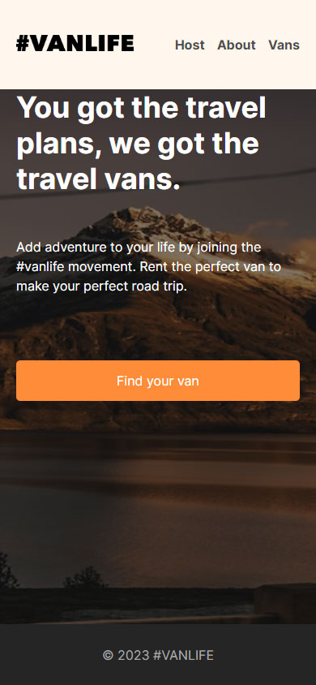

<h1 align="center">
    
</h1>

<br>

## 🧪 Tecnologias

Esse projeto foi desenvolvido com as seguintes tecnologias:

- [React](https://reactjs.org)
- [TypeScript](https://www.typescriptlang.org/)

## 🚀 Como executar

Clone o projeto e acesse a pasta do mesmo.

```bash
$ git clone https://github.com/diegorpais/van-life.git
$ cd van-life
```

Para iniciá-lo, siga os passos abaixo:
```bash
# Instalar as dependências
$ npm i

# Rodar o banco de dados fake
$ npm run dev-server

# Iniciar o projeto
$ npm run dev
```
O app estará disponível no seu browser pelo endereço http://localhost:3000.

## 💻 Projeto

O projeto foi criado apenas para estudo do React ao assistir o início de um codecamp no seguinte endereço: 

```bash
https://www.youtube.com/watch?v=nDGA3km5He4&ab_channel=freeCodeCamp.org

```

## 🔖 Layout

Céditos pelo layout:

```bash
https://scrimba.com/

```